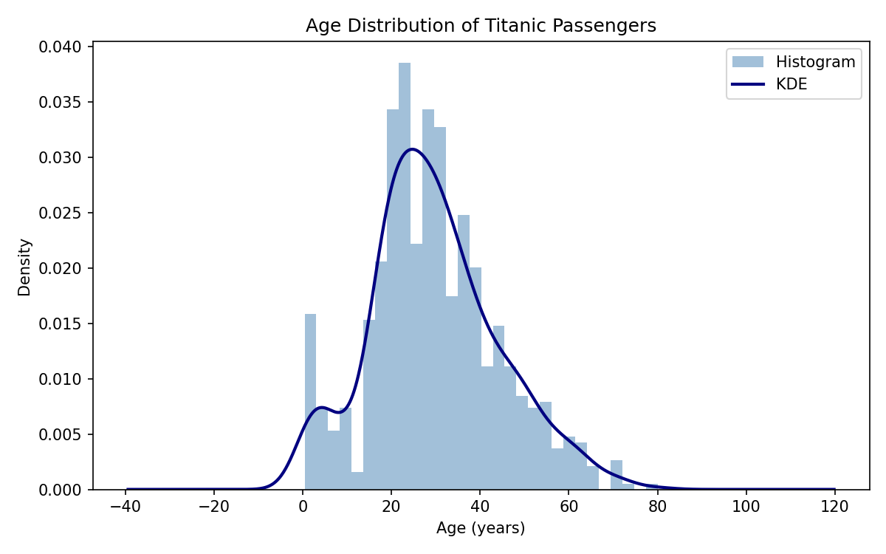
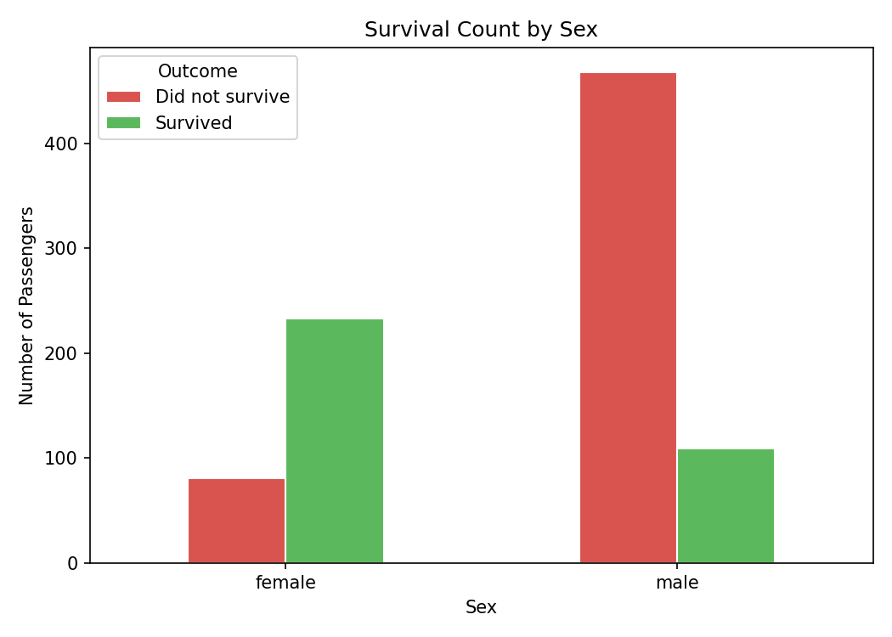
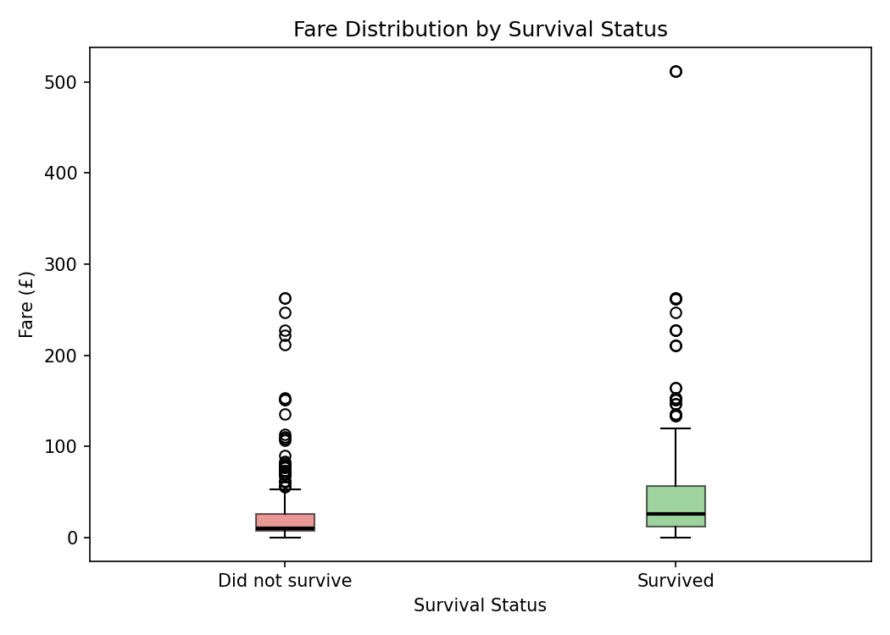
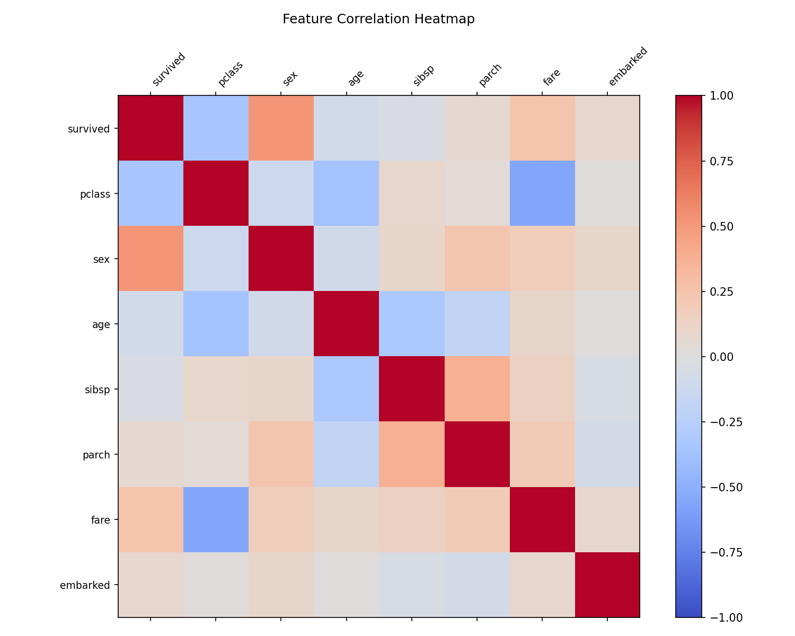
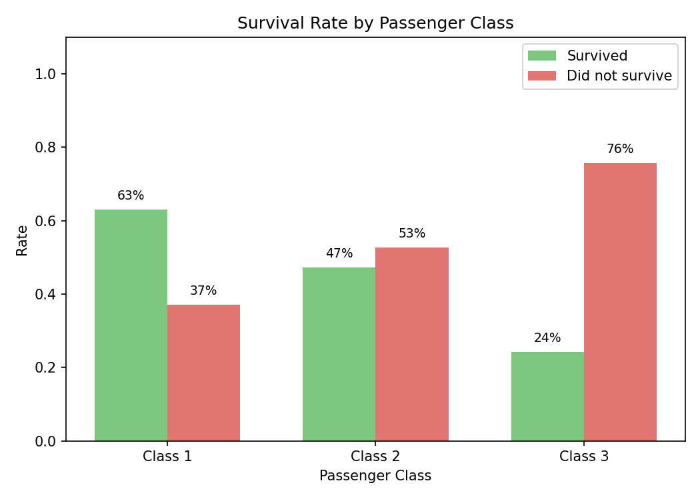

# Data Preprocessing Report

**Dataset:** Titanic (891 samples, seaborn built-in)
**Task:** Data cleaning, encoding, scaling, and exploratory visualisation

---

## 1. Data Loading and Inspection

The Titanic dataset contains 891 passenger records with 15 columns covering demographics (age, sex), ticket details (fare, class, embarked), and the survival outcome. After loading, a quick inspection with `df.info()` and `df.isnull().sum()` reveals three columns with missing values:

| Column | Missing | Action |
| ------ | ------- | ------ |
| age | 177 (19.9%) | Fill with column median |
| embarked | 2 (0.2%) | Fill with column mode |
| deck | 688 (77.2%) | Drop — too sparse to be useful |

---

## 2. Preprocessing Steps

**Missing values.** Age was filled with the median (28 years) to avoid shifting the distribution. Embarked was filled with the mode (Southampton). Deck was dropped because over three-quarters of its values are missing.

**Duplicates.** No duplicate rows were found.

**Irrelevant columns.** `who`, `adult_male`, `alive`, and `alone` were removed — they either duplicate information already present in other columns or are derived directly from the target variable.

**Categorical encoding.** `sex` was label-encoded (male = 0, female = 1). `embarked` was label-encoded (S = 0, C = 1, Q = 2). `class` was one-hot encoded into three binary columns to avoid implying an ordinal relationship.

**Scaling.** `age`, `fare`, `sibsp`, and `parch` were scaled to [0, 1] using `MinMaxScaler`. This ensures that high-magnitude features like fare (range 0–512) do not dominate distance-based calculations.

---

## 3. Visualisations

### Age Distribution

Passenger ages range from infants to 80 years old. The distribution is right-skewed with a peak around 20–30. The KDE curve shows a secondary shoulder near age 5, reflecting a small but notable number of children on board.

---

### Survival Count by Sex

Female passengers survived at a much higher rate than male passengers. Among females, survivors outnumber non-survivors; among males, the opposite is true by a wide margin. This reflects the "women and children first" evacuation policy.

---

### Fare by Survival Status

Survivors paid noticeably higher fares on average. The median fare for survivors is higher and there are more high-fare outliers in the survived group. This is partly because higher fares correspond to first-class tickets, which had better access to lifeboats.

---

### Feature Correlation Heatmap

The heatmap is computed on the preprocessed, encoded dataframe. `survived` correlates positively with `fare` and the `class_First` indicator, and negatively with `pclass` (since lower class numbers mean higher class). `age` has a weak negative correlation with survival, consistent with children being prioritised in the evacuation.

---

### Survival Rate by Passenger Class

First-class passengers had the highest survival rate (~63%), while third-class passengers had the lowest (~24%). The gap is substantial and reflects both cabin location (upper decks had quicker lifeboat access) and the social dynamics of the evacuation.

---

## 4. Summary

The preprocessing pipeline transformed raw Titanic data into a clean, model-ready format: missing values were imputed, sparse columns dropped, categorical variables encoded, and numerical features scaled. The visualisations confirm well-known patterns in the dataset — survival was strongly associated with sex, passenger class, and fare level.
