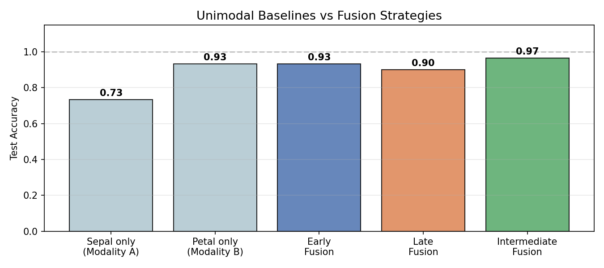
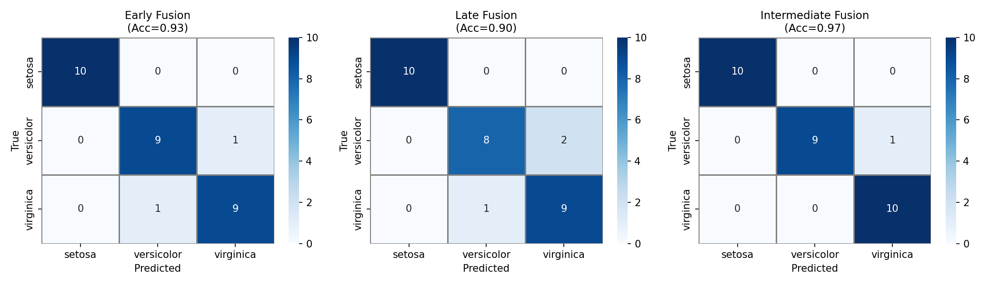

# Multi-Modal Learning

**Dataset:** Iris (150 samples, 4 features, 3 classes)
**Task:** Multi-class classification using two feature modalities

---

## Overview

Multi-modal learning refers to training models that consume more than one type of input — for example, an image and a caption, or audio and video frames. The core challenge is deciding *when* and *how* to combine information from the different sources. The main strategies are early fusion, late fusion, and intermediate fusion, each making a different trade-off between how early the modalities share information.

---

## 1. Early Fusion

Early fusion (also called feature-level fusion) concatenates the raw features from all modalities into a single vector before any learning takes place. The combined vector is then fed into a standard classifier.

```text
[Modality A features | Modality B features] → Classifier → Output
```

This is the simplest approach and works well when both modalities are already in a comparable representation space. The downside is that the model has no opportunity to learn modality-specific structure first — noise or irrelevant features in one modality can interfere with the other.

---

## 2. Late Fusion

Late fusion (decision-level fusion) trains a separate model for each modality independently. At inference time the per-modality predictions are combined — usually by averaging the predicted probabilities or by a majority vote.

```text
Modality A → Model A → prob_A
                               → average → Output
Modality B → Model B → prob_B
```

Because each model only sees one modality during training, it can specialise fully. The combination step is very light-weight and easy to interpret. The trade-off is that the models cannot learn cross-modal interactions — correlations between features in different modalities are invisible to them.

---

## 3. Intermediate Fusion

Intermediate fusion sits between the two extremes. Each modality is first processed by its own encoder (one or more layers), which learns a modality-specific embedding. These embeddings are then concatenated and passed to a shared classifier.

```text
Modality A → Encoder A → embedding A
                                      → concat → Shared Classifier → Output
Modality B → Encoder B → embedding B
```

This allows each branch to extract useful representations before the modalities interact, giving the shared classifier a richer and cleaner signal. It is the most common design in modern multi-modal architectures.

---

## 4. Cross-Modal Attention

Cross-modal attention extends the Transformer attention mechanism across modalities. A query from one modality attends to keys and values from another, so each modality can selectively pull in relevant information from the other at each position.

```text
Attention(Q_A, K_B, V_B)  — modality A queries into modality B
```

This is the foundation of architectures like CLIP (image–text), ViLBERT (vision–language), and Flamingo (vision–language generation). Unlike the fusion strategies above, cross-modal attention does not require a fixed combination point — attention can happen at multiple layers.

---

## 5. Contrastive Multi-Modal Learning

Contrastive learning trains the model to pull together representations of matched pairs (e.g., an image and its caption) and push apart unmatched pairs in a shared embedding space. CLIP (Radford et al., 2021) is the canonical example: it trains a visual encoder and a text encoder jointly so that image–text pairs from the same sample are closer in embedding space than mismatched pairs.

```text
Image → Visual Encoder → v
                            → cosine similarity → contrastive loss
Text  → Text Encoder  → t
```

The resulting embeddings generalise well to zero-shot tasks — given a new class name as text, the model can classify images it has never explicitly seen during training.

---

## Experiment

The Iris dataset is split into two artificial modalities:
- **Modality A** — sepal features (sepal length, sepal width)
- **Modality B** — petal features (petal length, petal width)

Three fusion strategies are implemented using MLPs (sklearn) and compared against unimodal baselines.

| Method | Description | Test Accuracy |
| ------ | ----------- | ------------- |
| Sepal only (A) | Unimodal baseline | 73.33% |
| Petal only (B) | Unimodal baseline | 93.33% |
| Early Fusion | Concatenate features → single MLP | **93.33%** |
| Late Fusion | Two MLPs, average probabilities | 90.00% |
| Intermediate Fusion | Per-modality encoder + shared MLP | **96.67%** |

### Fusion Strategy Comparison



Modality A (sepal) alone is the weakest at 73.33% — sepal dimensions are not very discriminative for Iris. Modality B (petal) already reaches 93.33%. All three fusion methods match or exceed the better unimodal baseline, confirming that combining sources helps. Intermediate fusion is the strongest because the per-modality encoders can extract complementary representations before they are merged.

---

### Confusion Matrices



Versicolor and Virginica are the hard cases across all methods — they overlap in sepal space, which is why Modality A alone struggles. Petal features resolve most of that ambiguity, and the fusion models inherit that benefit.

---

## Conclusion

The choice of fusion strategy depends on how much the modalities complement each other and how much cross-modal interaction the task requires. For well-separated modalities carrying redundant information, late fusion is often sufficient and easier to maintain. When one modality is weak on its own, early or intermediate fusion can pull it up. For complex cross-modal reasoning at scale, attention-based methods and contrastive learning are the current state of the art.
