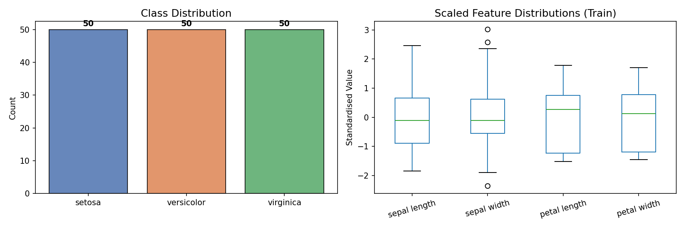
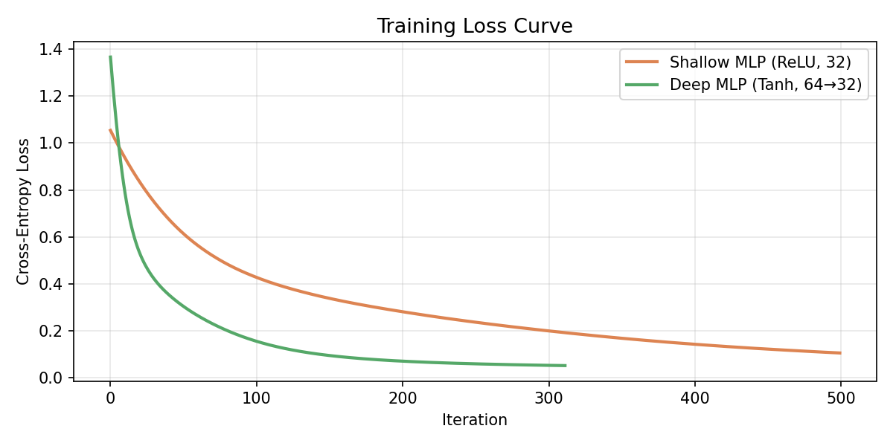
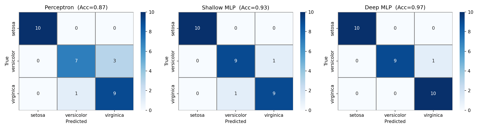
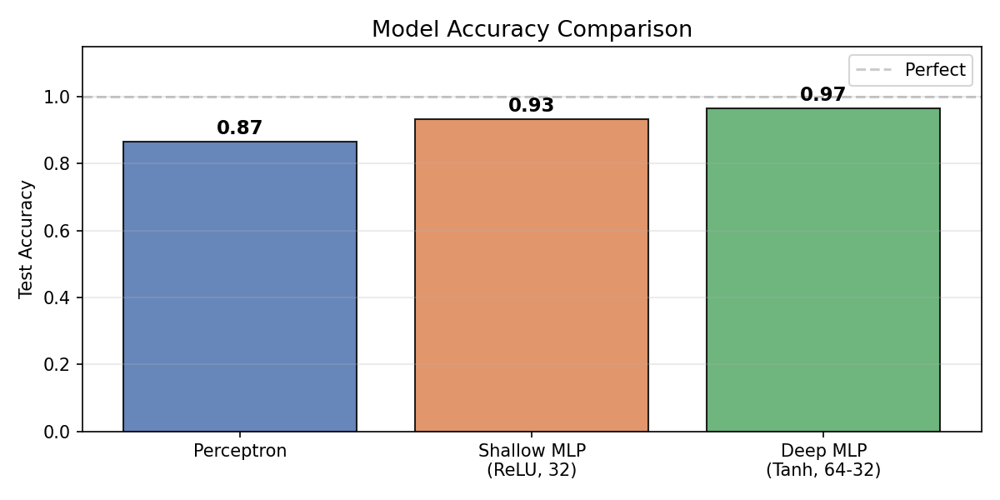
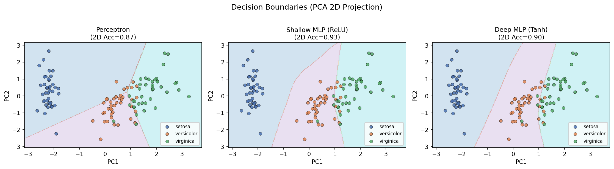

# Neural Network Models

**Dataset:** Iris (150 samples, 4 features, 3 classes)
**Task:** Multi-class classification (Setosa / Versicolor / Virginica)
**Train/Test Split:** 80% / 20%

---

## Overview

Neural networks are computational models that stack layers of weighted connections between nodes. Each node applies an activation function to its inputs, introducing non-linearity. With enough layers and neurons, the network can approximate complex mappings from inputs to outputs. Below I summarise the main architectures I have studied.

---

## 1. Perceptron

The Perceptron (Rosenblatt, 1958) is the simplest neural network — a single layer that maps inputs directly to output classes. It computes a weighted sum of the inputs and passes the result through a step function:

```text
output = step( W · x + b )
```

Because there are no hidden layers, the Perceptron can only draw straight-line boundaries in the feature space. This means it cannot separate classes that are not linearly arranged — for example, it cannot solve the XOR problem. The weight update rule only fires when a sample is misclassified, so training stalls if the data is not linearly separable.

---

## 2. Multi-Layer Perceptron (MLP)

Adding hidden layers with non-linear activations solves the linear limitation. Each hidden layer transforms the representation, so by the time the signal reaches the output, even tangled class boundaries can be separated. Training uses backpropagation: the loss gradient is propagated backwards through the layers, and each weight is nudged in the direction that reduces error.

```text
Input → [Hidden Layer (ReLU)] → ... → [Output (Softmax)]
```

ReLU (`max(0, x)`) is the default choice today because it avoids the vanishing gradient problem that Sigmoid and Tanh suffer from in deep networks. The Universal Approximation Theorem says that a single hidden layer with enough neurons can represent any continuous function, though deeper networks are more parameter-efficient in practice.

Two variants were implemented in the notebook:

| Variant     | Architecture      | Activation |
| ----------- | ----------------- | ---------- |
| Shallow MLP | 4 → 32 → 3        | ReLU       |
| Deep MLP    | 4 → 64 → 32 → 3   | Tanh       |

---

## 3. Convolutional Neural Network (CNN)

CNNs (LeCun et al., 1998) were designed for image data. The idea is that nearby pixels are more relevant to each other than distant ones, so instead of connecting every input to every neuron, a small filter slides across the image and produces a feature map. The same filter weights are reused at every position, which dramatically reduces the number of parameters.

```text
Input Image → [Conv + ReLU] → [Pooling] → ... → [Flatten] → [FC] → Output
```

A pooling layer follows each convolution, downsampling the feature map and making the representation tolerant of small spatial shifts. After several such blocks, the output is flattened and fed into a standard fully-connected classifier. This architecture became the standard for image recognition — ResNet, VGG, and EfficientNet are all variants of this core idea.

---

## 4. Recurrent Neural Network (RNN / LSTM)

RNNs were designed for sequential data — text, audio, time series — where the order of inputs matters. The network maintains a hidden state that is updated at each time step, so earlier inputs can influence later predictions:

```text
h_t = f( W_h · h_{t-1} + W_x · x_t + b )
```

The practical problem is that gradients shrink as they are backpropagated through many time steps, making it hard to learn long-range dependencies. The LSTM (Long Short-Term Memory) fixes this with a cell state that runs through the sequence with only minor, controlled modifications. Three gates — input, forget, and output — decide what information to write, erase, and read at each step. The GRU is a lighter variant that merges the forget and input gates into one.

RNNs and LSTMs were the backbone of machine translation and speech recognition before Transformers arrived.

---

## 5. Autoencoder

An Autoencoder is trained to compress input data into a compact representation and then reconstruct it. There are no class labels involved — the reconstruction error between the input and output is the only training signal.

```text
Input → Encoder → Latent Code z → Decoder → Reconstructed Input
```

The bottleneck in the middle forces the encoder to keep only the most informative structure. The learned latent codes can be used for dimensionality reduction, anomaly detection (unusual inputs will have high reconstruction error), or as features for downstream tasks. A Variational Autoencoder (VAE) adds a probabilistic constraint on the latent space, which makes it possible to generate new samples by sampling from the latent distribution.

---

## 6. Transformer

The Transformer (Vaswani et al., 2017) removed recurrence entirely and replaced it with self-attention. Every position in the sequence computes a query, a key, and a value. The attention score between two positions measures how relevant they are to each other:

```text
Attention(Q, K, V) = softmax( Q K^T / √d_k ) · V
```

Because all positions are compared simultaneously, the computation is fully parallelisable — this is what allowed Transformers to scale to billions of parameters. Positional encodings are added to the embeddings so the model knows the order of tokens. The original design has an encoder that reads the input and a decoder that generates the output, but many modern models use only one of the two halves. BERT uses only the encoder; GPT uses only the decoder.

---

## Experimental Results

The three models were trained on 120 samples and evaluated on 30 held-out samples from the Iris dataset.

| Model       | Architecture      | Activation | Test Accuracy  |
| ----------- | ----------------- | ---------- | -------------- |
| Perceptron  | 4 → 3             | Step       | **86.67%**     |
| Shallow MLP | 4 → 32 → 3        | ReLU       | **93.33%**     |
| Deep MLP    | 4 → 64 → 32 → 3   | Tanh       | **96.67%**     |

### Data Overview



The dataset is balanced at 50 samples per class. After standardisation, all four features are centred around zero and have unit variance, which helps gradient-based optimisers converge more reliably.

---

### Training Loss Curves



The Deep MLP (Tanh) converges in around 312 iterations. The Shallow MLP (ReLU) runs for the full 500 iterations without fully converging, which is expected — the Adam optimiser makes fast early progress but slows down as the loss flattens.

---

### Confusion Matrices



The Perceptron misclassifies 4 samples, all in the Versicolor/Virginica region where the classes overlap and a straight boundary is insufficient. The Shallow MLP drops this to 2 misclassifications, and the Deep MLP makes only 1 error.

---

### Model Accuracy Comparison



The accuracy gap between the Perceptron and the two MLPs is consistent with the non-linear overlap between Versicolor and Virginica — a boundary that cannot be a straight line.

---

### Decision Boundaries (PCA 2D Projection)



Projecting the 4D input down to 2 principal components makes the boundary shape visible. The Perceptron draws a linear boundary and cannot cleanly separate all three classes. The Shallow MLP produces a curved boundary, and the Deep MLP carves out more detailed regions — though for a dataset this small, the extra complexity does not hurt generalisation.

---

## Conclusion

The jump from Perceptron to MLP is the most important step in this hierarchy: adding a hidden layer with a non-linear activation is what turns a limited linear classifier into a general-purpose learner. CNNs and RNNs then specialise this idea for spatial and sequential structure respectively, while Transformers generalise sequence modelling further by replacing recurrence with attention. The Iris experiments show the difference concretely — moving from 86.67% (Perceptron) to 96.67% (Deep MLP) just by adding two hidden layers.
