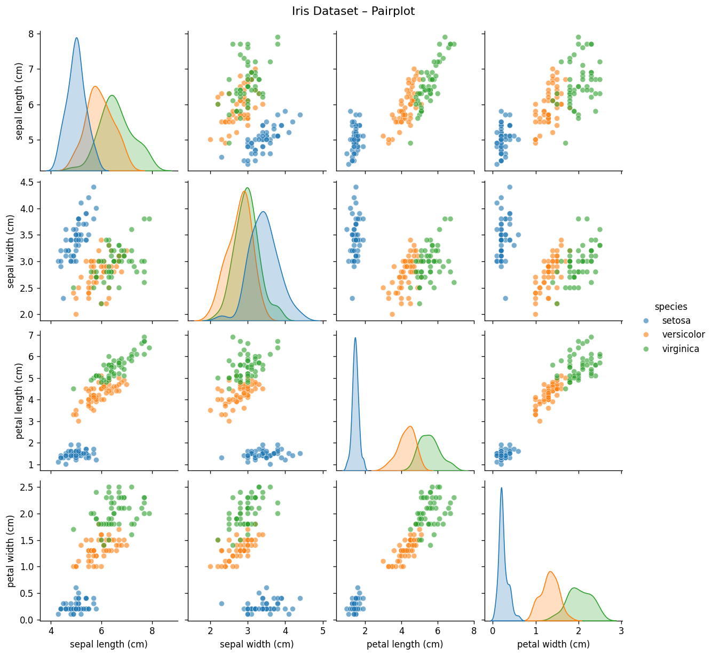
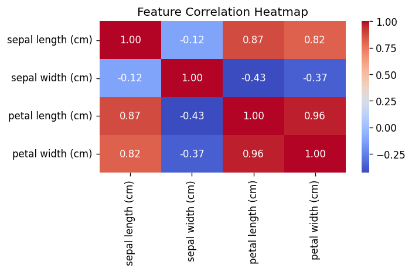
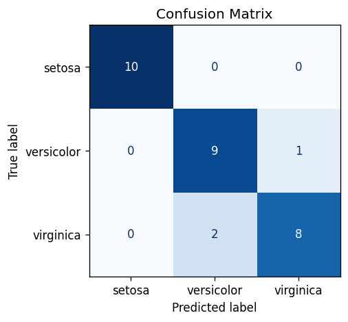
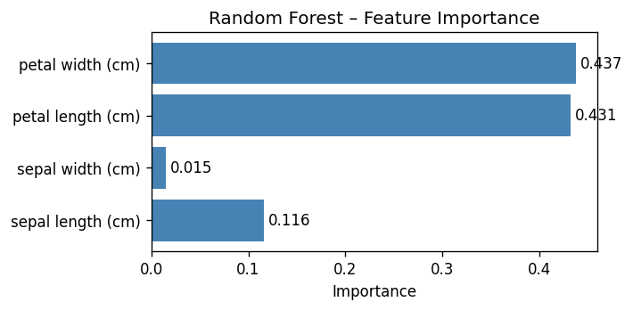

# Iris Classification Report

**Model:** Random Forest Classifier
**Dataset:** Iris (150 samples, 4 features, 3 classes)
**Train/Test Split:** 80% / 20%

---

## 1. Data Exploration

The Iris dataset contains 150 samples equally distributed across three species: *setosa*, *versicolor*, and *virginica*. Each sample has four features: sepal length, sepal width, petal length, and petal width.

The pairplot below shows that *setosa* is linearly separable from the other two classes, while *versicolor* and *virginica* overlap slightly.

The correlation heatmap reveals that petal length and petal width are strongly correlated (r ≈ 0.96), suggesting they carry similar information.

---

## 2. Model & Results

A **Random Forest** with 100 decision trees was trained on 120 samples and evaluated on 30 held-out samples.

| Metric | Value |
|--------|-------|
| Test Accuracy | **90.0%** |
| Macro Avg Precision | 0.90 |
| Macro Avg Recall | 0.90 |
| Macro Avg F1 | 0.90 |

*Setosa* was classified perfectly. Minor confusion occurred between *versicolor* and *virginica*, consistent with their overlapping feature distributions.

---

## 3. Feature Importance

Petal length and petal width are the most discriminative features, together accounting for over 90% of the model's decision weight.

---

## 4. Conclusion

The Random Forest classifier achieved **90% accuracy** on the Iris dataset with no preprocessing required. The model performs best on *setosa* and shows slight difficulty distinguishing *versicolor* from *virginica*, which is expected given their feature overlap.
